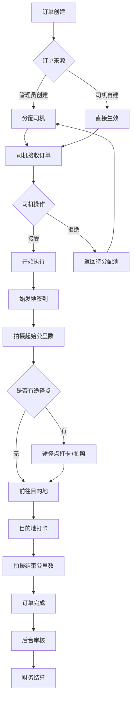
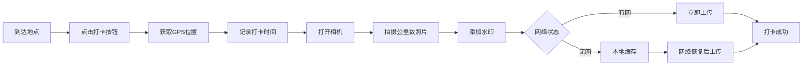
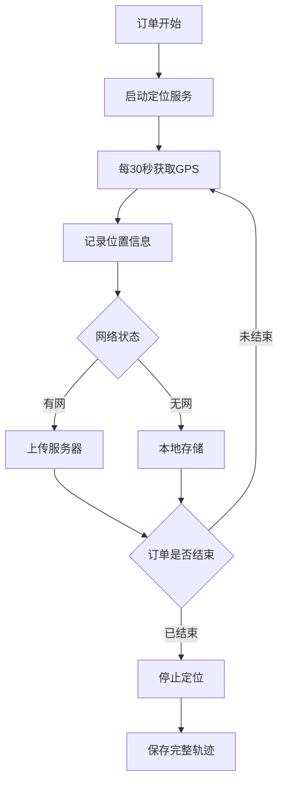

# 司机订单管理系统 - 产品需求文档（PRD）

> **文档版本**: v1.0  
> **创建日期**: 2026-04-20  
> **文档状态**: 已确认  
> **维护人**: 项目经理  

---

## 📋 文档目录

1. [项目概述](#1-项目概述)
2. [用户角色](#2-用户角色)
3. [业务流程](#3-业务流程)
4. [功能需求](#4-功能需求)
5. [数据需求](#5-数据需求)
6. [接口需求](#6-接口需求)
7. [非功能需求](#7-非功能需求)
8. [UI/UX设计](#8-uiux设计)
9. [技术方案](#9-技术方案)
10. [测试计划](#10-测试计划)
11. [部署方案](#11-部署方案)
12. [项目计划](#12-项目计划)

---

## 1. 项目概述

### 1.1 项目背景

老板需要一套完整的司机订单管理系统，用于管理车队司机的订单执行过程。系统需要确保订单完成的真实性，通过公里数照片和定位轨迹作为与甲方结账和司机结算的依据。

### 1.2 项目目标

1. **订单管理**：实现订单的创建、分配、执行、完成全流程管理
2. **真实验证**：通过公里数照片和定位轨迹验证订单执行的真实性
3. **财务结算**：完善的财务管理，支持与甲方和司机的结算
4. **实时监控**：实时掌握司机位置和订单状态
5. **安全保障**：提供紧急情况SOS功能，保障司机安全

### 1.3 系统范围

#### 包含的功能
- Android司机端APP
- Web后台管理系统
- 后端API服务
- 数据库存储
- 文件存储服务

#### 不包含的功能
- iOS版本（暂不支持）
- 乘客/甲方下单端（订单由老板手动创建或司机自建）
- 第三方支付集成（财务仅做记录，支付线下进行）

### 1.4 名词解释

| 名词 | 说明 |
|------|------|
| 始发地 | 订单起点位置 |
| 目的地 | 订单终点位置 |
| 途径点 | 订单中途需要经过的点（可选） |
| 打卡 | 司机在指定地点进行签到操作 |
| 公里数照片 | 拍摄车辆仪表盘显示公里数的照片 |
| 轨迹 | 司机行驶过程中的GPS定位点集合 |
| SOS | 紧急求助功能 |

---

## 2. 用户角色

### 2.1 角色定义

#### 角色1：系统管理员（老板）
- **数量**：1人
- **权限**：最高权限，可访问所有功能
- **使用端**：Web后台管理系统
- **主要操作**：
  - 创建和管理订单
  - 管理司机和乘客信息
  - 查看实时监控
  - 财务管理
  - 系统配置

#### 角色2：司机
- **数量**：多人（可扩展）
- **权限**：仅能访问自己的订单和数据
- **使用端**：Android APP
- **主要操作**：
  - 接收和创建订单
  - 执行订单（打卡、拍照）
  - 查看个人统计
  - 异常上报
  - 紧急求助

### 2.2 账号管理

#### 司机账号
- **创建方式**：由管理员在后台创建
- **账号格式**：手机号或自定义编号
- **密码**：初始密码由系统生成，司机首次登录后可修改
- **禁用/启用**：管理员可控制账号状态

#### 管理员账号
- **创建方式**：系统初始化时创建
- **账号格式**：admin
- **密码**：强密码策略

---

## 3. 业务流程

### 3.1 订单完整流程



### 3.2 打卡流程



### 3.3 定位采集流程



### 3.4 异常情况处理流程

#### 3.4.1 订单拒绝流程
```
司机拒绝订单 → 选择拒绝原因 → 提交 → 订单回到待分配池 → 管理员重新分配
```

#### 3.4.2 异常上报流程
```
司机上报异常 → 选择类型 → 填写描述 → 上传照片 → 提交 → 后台收到通知 → 管理员处理 → 反馈结果
```

#### 3.4.3 紧急情况流程
```
司机触发SOS → 自动采集证据 → 高频上传定位 → 后台警报 → 管理员处理 → 解除紧急状态
```

#### 3.4.4 离线处理流程
```
检测到无网络 → 数据缓存到本地 → 继续正常工作 → 检测网络恢复 → 自动同步数据 → 提示同步结果
```

---

## 4. 功能需求

## 4.1 Android司机端APP

### 4.1.1 登录模块

#### 功能描述
司机使用分配的账号密码登录APP

#### 功能详情

**FR-APP-001: 账号密码登录**
- **优先级**: P0（最高）
- **前置条件**: 司机已有账号
- **操作流程**:
  1. 输入账号（手机号或编号）
  2. 输入密码
  3. 点击登录按钮
  4. 验证成功后进入首页
- **业务规则**:
  - 密码错误超过5次，账号锁定30分钟
  - 登录失败显示具体原因（账号不存在、密码错误、账号被禁用）
- **异常处理**:
  - 网络异常：提示检查网络
  - 服务器异常：提示稍后重试

**FR-APP-002: 记住密码**
- **优先级**: P1
- **功能说明**:
  - 勾选"记住密码"后，下次打开APP自动填充账号密码
  - 密码加密存储在本地

**FR-APP-003: 自动登录**
- **优先级**: P1
- **功能说明**:
  - 如果上次选择了"记住密码"，打开APP自动登录
  - Token过期后需要重新登录

**FR-APP-004: 修改密码**
- **优先级**: P2
- **操作流程**:
  1. 进入个人中心
  2. 点击"修改密码"
  3. 输入原密码
  4. 输入新密码（两次确认）
  5. 提交修改
- **业务规则**:
  - 新密码长度8-20位
  - 必须包含字母和数字
  - 不能与原密码相同

---

### 4.1.2 首页模块

#### 功能描述
APP首页，显示当前订单信息和快捷操作

#### 功能详情

**FR-APP-005: 首页布局**
- **优先级**: P0
- **页面元素**:
  - 顶部：标题栏（显示"司机端"）
  - 右上角：紧急SOS按钮（红色圆形）
  - 中部：当前订单卡片（如有进行中订单）
  - 下部：快捷功能入口
  - 底部：导航栏（首页、订单、我的）

**FR-APP-006: 紧急SOS按钮**
- **优先级**: P0
- **位置**: 首页右上角
- **样式**: 红色圆形按钮，直径50dp，带警示图标
- **交互**:
  - 单击：弹出确认对话框"确认触发紧急求助？"
  - 长按3秒：直接触发（防止误触同时保证快速响应）
- **触发后**:
  1. 全屏红色警示界面
  2. 显示"紧急求助已触发"
  3. 显示倒计时（10秒）和"取消"按钮
  4. 自动拍摄前后摄像头照片
  5. 开始录音（最多5分钟）
  6. 每5秒上传一次精确位置
  7. 向后台发送紧急警报
- **解除方式**:
  - 司机点击"取消"按钮（需输入密码确认）
  - 后台管理员确认后远程解除

**FR-APP-007: 当前订单卡片**
- **优先级**: P0
- **显示内容**:
  - 订单号
  - 始发地和目的地
  - 乘客姓名和电话
  - 订单状态
  - 操作按钮（查看详情、导航、打卡等）
- **交互**: 点击卡片进入订单详情页

**FR-APP-008: 快捷功能**
- **优先级**: P1
- **功能入口**:
  - 新建订单
  - 扫码接单（预留）
  - 异常上报
  - 联系客服

---

### 4.1.3 订单管理模块

#### 功能描述
管理所有订单，包括接收、创建、查看等操作

#### 功能详情

**FR-APP-009: 订单列表**
- **优先级**: P0
- **Tab切换**:
  - 待接单：等待司机接受的订单
  - 进行中：正在执行的订单
  - 已完成：已完成的订单
  - 已取消：已取消的订单
- **列表项显示**:
  - 订单号
  - 始发地 → 目的地
  - 创建时间
  - 订单状态标签
  - 金额（如有）
- **交互**:
  - 下拉刷新
  - 上拉加载更多
  - 点击 item 进入详情页
- **筛选功能**:
  - 按时间筛选（今天、本周、本月、自定义）
  - 按状态筛选

**FR-APP-010: 接收订单**
- **优先级**: P0
- **触发条件**: 有新订单推送或主动查看待接单列表
- **订单详情显示**:
  - 订单基本信息（订单号、创建时间）
  - 始发地（地址、地图预览）
  - 目的地（地址、地图预览）
  - 途径点列表（如有）
  - 乘客信息（姓名、电话）
  - 备注信息
  - 预估里程
- **操作按钮**:
  - 接受订单（绿色按钮）
  - 拒绝订单（灰色按钮）
- **接受订单**:
  - 点击后订单状态变为"进行中"
  - 自动跳转到订单执行页面
  - 推送通知管理员
- **拒绝订单**:
  - 点击后弹出拒绝原因选择框
  - 原因选项：
    - 距离太远
    - 时间冲突
    - 车辆问题
    - 个人原因
    - 其他（需填写说明）
  - 提交后订单回到待分配池
  - 记录拒绝历史

**FR-APP-011: 创建订单**
- **优先级**: P0
- **入口**: 首页快捷功能或订单列表右上角"+"按钮
- **表单字段**:
  - 始发地（可选，调用地图选点）
  - 目的地（可选，调用地图选点）
  - 途径点（可选，可添加多个）
  - 乘客选择（从乘客列表选择或手动输入）
  - 备注（可选）
- **业务规则**:
  - 始发地和目的地至少填写一个
  - 途径点最多5个
  - 必须关联乘客
- **提交后**:
  - 订单立即生效
  - 自动分配给当前司机
  - 订单状态为"进行中"
  - 通知管理员

**FR-APP-012: 订单详情**
- **优先级**: P0
- **显示内容**:
  - 订单基本信息
  - 路线图（地图展示）
  - 打卡记录列表
  - 公里数照片
  - 轨迹回放按钮
  - 操作按钮（根据状态显示不同按钮）
- **操作按钮**:
  - 待接单：接受、拒绝
  - 进行中：开始打卡、导航、异常上报、取消订单
  - 已完成：查看轨迹、查看照片
  - 已取消：查看取消原因

**FR-APP-013: 取消订单**
- **优先级**: P1
- **触发条件**: 订单进行中时
- **操作流程**:
  1. 点击"取消订单"
  2. 选择取消原因
  3. 填写详细说明
  4. 提交申请
- **业务规则**:
  - 取消申请需管理员确认
  - 取消后订单状态变为"已取消"
  - 记录取消历史

---

### 4.1.4 订单执行模块

#### 功能描述
司机执行订单的核心流程，包括打卡、拍照等

#### 功能详情

**FR-APP-014: 始发地签到**
- **优先级**: P0
- **触发条件**: 订单状态为"进行中"且未开始打卡
- **操作流程**:
  1. 点击"始发地签到"按钮
  2. 系统获取当前GPS位置
  3. 记录打卡时间
  4. 自动打开相机
  5. 拍摄起始公里数照片
  6. 照片添加水印（时间、地点、经纬度）
  7. 上传照片（或缓存）
  8. 订单状态更新为"已开始"
- **业务规则**:
  - 必须实时拍摄，不能从相册选择
  - 照片必须清晰显示公里数
  - 水印信息不可篡改
- **离线支持**: 无网络时缓存到本地

**FR-APP-015: 途径点打卡**
- **优先级**: P1
- **触发条件**: 订单有途径点且已通过始发地签到
- **操作流程**:
  1. 显示途径点列表
  2. 点击某个途径点的"打卡"按钮
  3. 获取当前位置
  4. 记录打卡时间
  5. 拍摄公里数照片
  6. 添加水印
  7. 上传或缓存
- **业务规则**:
  - 途径点可按顺序打卡
  - 每个途径点只需打卡一次
  - 可跳过途径点（需记录）

**FR-APP-016: 目的地打卡**
- **优先级**: P0
- **触发条件**: 已通过始发地签到（和途径点打卡）
- **操作流程**:
  1. 点击"目的地打卡"按钮
  2. 获取当前位置
  3. 记录打卡时间
  4. 拍摄结束公里数照片
  5. 添加水印
  6. 上传或缓存
  7. 订单状态更新为"已完成"
  8. 停止定位服务
- **业务规则**:
  - 完成后订单不可再修改
  - 自动计算行驶里程（结束公里数 - 起始公里数）

**FR-APP-017: 公里数照片拍摄**
- **优先级**: P0
- **功能说明**:
  - 调用系统相机
  - 强制使用后置摄像头
  - 禁止从相册选择
  - 照片自动添加水印
- **水印内容**:
  - 日期时间：YYYY-MM-DD HH:mm:ss
  - 地点：详细地址
  - 经纬度：经度,纬度
  - 订单号
  - 打卡类型（起始/途径/结束）
- **照片处理**:
  - 压缩质量：80%
  - 最大尺寸：1920x1080
  - 格式：JPG
  - 文件大小：控制在500KB以内

**FR-APP-018: 打卡提醒**
- **优先级**: P2
- **功能说明**:
  - 后台可配置打卡间隔
  - 到达间隔时间后推送提醒
  - 提醒声音和震动
  - 可关闭提醒

---

### 4.1.5 定位服务模块

#### 功能描述
持续采集司机位置信息并上传

#### 功能详情

**FR-APP-019: 实时定位采集**
- **优先级**: P0
- **触发条件**: 订单状态为"进行中"
- **采集频率**: 默认30秒一次（可配置15-60秒）
- **采集内容**:
  - 经度
  - 纬度
  - 海拔（如有）
  - 速度
  - 方向
  - 精度
  - 时间戳
- **智能调整**:
  - 静止状态（速度<5km/h）：60秒一次
  - 移动状态：30秒一次
  - 高速状态（速度>60km/h）：15秒一次

**FR-APP-020: 定位数据存储**
- **优先级**: P0
- **存储方式**:
  - 有网络：立即上传服务器
  - 无网络：存储到本地数据库
- **本地存储**:
  - 使用Room数据库
  - 表名：dingweiJilu
  - 字段：订单ID、经纬度、时间、速度、是否已上传
- **容量限制**: 最多缓存7天数据

**FR-APP-021: 数据同步**
- **优先级**: P0
- **触发条件**:
  - 网络从断开恢复到连接
  - APP启动时检测到有待同步数据
  - 手动触发同步
- **同步策略**:
  - 按时间顺序上传
  - 批量上传（每次50条）
  - 失败重试（最多3次）
  - 同步进度提示
- **同步结果**:
  - 成功：删除本地缓存
  - 失败：保留本地数据，下次继续

**FR-APP-022: 轨迹查看**
- **优先级**: P1
- **功能说明**:
  - 在地图上显示当前订单轨迹
  - 显示起点、终点、途径点标记
  - 显示打卡点标记
  - 可查看历史订单轨迹
  - 支持离线查看本地轨迹
- **交互**:
  - 缩放地图
  - 拖动地图
  - 点击轨迹点显示详情

**FR-APP-023: 后台定位服务**
- **优先级**: P0
- **功能说明**:
  - 订单进行中时，即使APP退到后台也持续定位
  - 显示前台服务通知
  - 通知显示：订单号、已行驶时间
  - 点击通知回到APP
- **权限要求**:
  - 后台定位权限
  - 忽略电池优化
  - 自启动权限（部分手机需要）

---

### 4.1.6 导航模块

#### 功能描述
调用外部地图APP进行导航

#### 功能详情

**FR-APP-024: 调用导航**
- **优先级**: P0
- **触发位置**: 订单详情页
- **导航类型**:
  - 导航到始发地
  - 导航到目的地
  - 导航到途径点
- **操作流程**:
  1. 点击"导航"按钮
  2. 选择地图APP（高德、百度、腾讯等）
  3. 自动打开选中的地图APP
  4. 传入起点和终点坐标
- **业务规则**:
  - 检测手机已安装的地图APP
  - 优先使用高德地图
  - 如未安装任何地图APP，提示安装

**FR-APP-025: 地图APP检测**
- **优先级**: P1
- **功能说明**:
  - 检测已安装的地图APP
  - 显示可用地图APP列表
  - 记忆用户选择

---

### 4.1.7 消息通知模块

#### 功能描述
接收和展示各类推送消息

#### 功能详情

**FR-APP-026: 推送通知**
- **优先级**: P0
- **通知类型**:
  - 新订单通知（高优先级，声音+震动）
  - 打卡提醒（中优先级，声音）
  - 异常处理结果（中优先级）
  - 紧急状态解除（高优先级）
  - 系统公告（低优先级）
- **通知内容**:
  - 标题
  - 内容
  - 跳转链接
- **交互**:
  - 点击通知跳转到对应页面
  - 可在设置中关闭某些类型的通知

**FR-APP-027: 消息中心**
- **优先级**: P1
- **功能说明**:
  - 查看所有历史消息
  - 区分已读/未读
  - 按类型筛选
  - 删除消息
  - 一键全部已读

---

### 4.1.8 异常处理模块

#### 功能描述
司机上报各种异常情况

#### 功能详情

**FR-APP-028: 异常上报**
- **优先级**: P0
- **入口**: 订单详情页或首页快捷功能
- **异常类型**:
  - 车辆故障
  - 交通事故
  - 乘客问题
  - 路线问题
  - 天气原因
  - 其他
- **表单字段**:
  - 异常类型（必选）
  - 关联订单（可选，下拉选择）
  - 详细描述（必填，最多500字）
  - 现场照片（可选，最多5张）
  - 当前位置（自动获取）
- **提交流程**:
  1. 填写表单
  2. 点击提交
  3. 上传数据
  4. 提示提交成功
  5. 后台收到通知
- **后续**:
  - 可查看处理进度
  - 接收处理结果通知

**FR-APP-029: 异常记录查询**
- **优先级**: P2
- **功能说明**:
  - 查看自己上报的异常历史
  - 显示处理状态
  - 查看处理结果

---

### 4.1.9 个人中心模块

#### 功能描述
司机个人信息和设置

#### 功能详情

**FR-APP-030: 个人信息**
- **优先级**: P1
- **显示内容**:
  - 头像
  - 姓名
  - 手机号
  - 司机编号
  - 入职时间
  - 账号状态

**FR-APP-031: 数据统计**
- **优先级**: P1
- **统计维度**:
  - 今日/本周/本月/总计
- **统计数据**:
  - 完成订单数
  - 总行驶里程
  - 总收入（如后台返回）
  - 在线时长
- **展示方式**: 图表+数字

**FR-APP-032: 设置**
- **优先级**: P1
- **设置项**:
  - 推送通知开关
  - 打卡提醒开关
  - 定位频率选择（15秒/30秒/60秒）
  - 清除缓存
  - 关于我们
  - 退出登录

**FR-APP-033: 紧急联系人**
- **优先级**: P2
- **功能说明**:
  - 设置紧急联系人姓名
  - 设置紧急联系人电话
  - SOS触发时可自动通知

---

### 4.1.10 防作弊模块

#### 功能描述
检测和防止各种作弊行为

#### 功能详情

**FR-APP-034: 虚拟定位检测**
- **优先级**: P1
- **检测内容**:
  - 是否开启开发者选项
  - 是否开启模拟位置
  - GPS信号是否异常
  - 位置跳变是否合理
- **处理方式**:
  - 发现异常时警告司机
  - 记录异常日志
  - 上报后台

**FR-APP-035: 照片防伪**
- **优先级**: P0
- **防伪措施**:
  - 强制实时拍摄
  - 禁止从相册选择
  - 自动添加不可篡改的水印
  - 记录照片元数据（EXIF）
  - 照片哈希值校验

**FR-APP-036: 异常行为检测**
- **优先级**: P2
- **检测内容**:
  - 速度异常（超过150km/h）
  - 轨迹异常（直线距离与实际不符）
  - 时间异常（打卡时间不合理）
- **处理方式**:
  - 记录异常
  - 后台预警

---

## 4.2 Web后台管理系统

### 4.2.1 登录模块

**FR-WEB-001: 管理员登录**
- **优先级**: P0
- **登录方式**: 账号密码
- **安全措施**:
  - HTTPS传输
  - 密码加密
  - 登录失败次数限制
  - Session超时自动退出

---

### 4.2.2 仪表盘模块

**FR-WEB-002: 数据概览**
- **优先级**: P0
- **显示内容**:
  - 今日订单数（今日新增/进行中/已完成）
  - 今日活跃司机数
  - 今日总里程
  - 今日总收入
  - 待处理异常数
  - 紧急事件数
- **图表**:
  - 近7天订单趋势图
  - 近7天收入趋势图

**FR-WEB-003: 实时监控**
- **优先级**: P0
- **功能**:
  - 地图显示所有在线司机
  - 点击司机显示详情
  - 显示进行中订单
  - 自动刷新（30秒）

---

### 4.2.3 订单管理模块

**FR-WEB-004: 创建订单**
- **优先级**: P0
- **表单字段**:
  - 始发地（地图选点）
  - 目的地（地图选点）
  - 途径点（可添加多个）
  - 乘客（下拉选择）
  - 司机（下拉选择，可选）
  - 备注
- **业务规则**:
  - 始发地和目的地至少填一个
  - 必须关联乘客

**FR-WEB-005: 订单列表**
- **优先级**: P0
- **筛选条件**:
  - 订单状态
  - 时间范围
  - 司机
  - 乘客
  - 订单号搜索
- **列表字段**:
  - 订单号
  - 始发地→目的地
  - 司机
  - 乘客
  - 状态
  - 创建时间
  - 操作
- **操作**:
  - 查看详情
  - 取消订单
  - 重新分配
  - 导出数据

**FR-WEB-006: 订单详情**
- **优先级**: P0
- **显示内容**:
  - 订单基本信息
  - 路线图
  - 轨迹回放
  - 打卡记录
  - 公里数照片
  - 操作日志
  - 财务信息

**FR-WEB-007: 轨迹回放**
- **优先级**: P1
- **功能**:
  - 在地图上播放轨迹动画
  - 可调节播放速度
  - 显示速度变化
  - 显示打卡点
  - 显示时间点

**FR-WEB-008: 订单导出**
- **优先级**: P2
- **导出格式**: Excel
- **导出内容**: 订单列表字段

---

### 4.2.4 司机管理模块

**FR-WEB-009: 司机列表**
- **优先级**: P0
- **列表字段**:
  - 司机编号
  - 姓名
  - 手机号
  - 状态（在线/离线/禁用）
  - 今日订单数
  - 今日里程
  - 操作
- **操作**:
  - 查看详情
  - 编辑
  - 禁用/启用
  - 重置密码

**FR-WEB-010: 添加司机**
- **优先级**: P0
- **表单字段**:
  - 姓名（必填）
  - 手机号（必填，唯一）
  - 身份证号（可选）
  - 车牌号（可选）
  - 备注
- **系统生成**:
  - 司机编号
  - 初始密码

**FR-WEB-011: 司机详情**
- **优先级**: P1
- **显示内容**:
  - 基本信息
  - 订单统计
  - 收入统计
  - 违规记录
  - 操作日志

---

### 4.2.5 乘客管理模块

**FR-WEB-012: 乘客列表**
- **优先级**: P0
- **列表字段**:
  - 乘客ID
  - 姓名
  - 手机号
  - 订单数
  - 总消费
  - 操作

**FR-WEB-013: 添加乘客**
- **优先级**: P0
- **表单字段**:
  - 姓名（必填）
  - 手机号（必填）
  - 公司名称（可选）
  - 备注

---

### 4.2.6 财务管理模块

**FR-WEB-014: 计费规则配置**
- **优先级**: P1
- **配置项**:
  - 单价（元/公里）
  - 起步价
  - 过路费计算方式
  - 停车费计算方式
  - 等待费（元/小时）
  - 司机提成比例

**FR-WEB-015: 订单结算**
- **优先级**: P0
- **功能**:
  - 自动计算订单金额
  - 自动计算司机提成
  - 手动调整金额
  - 标记结算状态（未结算/已结算）
  - 结算备注

**FR-WEB-016: 对账单生成**
- **优先级**: P1
- **甲方对账单**:
  - 选择时间范围
  - 自动生成对账单
  - 导出Excel/PDF
- **司机工资单**:
  - 选择司机和时间
  - 生成工资单
  - 导出Excel/PDF

**FR-WEB-017: 收支明细**
- **优先级**: P1
- **功能**:
  - 所有收入记录
  - 所有支出记录
  - 筛选和搜索
  - 导出

**FR-WEB-018: 财务报表**
- **优先级**: P2
- **报表类型**:
  - 日报表
  - 周报表
  - 月报表
  - 自定义报表
- **展示方式**: 表格+图表

---

### 4.2.7 定位管理模块

**FR-WEB-019: 实时位置**
- **优先级**: P0
- **功能**:
  - 地图显示所有在线司机
  - 显示司机信息
  - 自动刷新

**FR-WEB-020: 轨迹查询**
- **优先级**: P1
- **查询条件**:
  - 司机
  - 时间范围
  - 订单
- **展示**: 地图轨迹

---

### 4.2.8 异常管理模块

**FR-WEB-021: 异常列表**
- **优先级**: P0
- **列表字段**:
  - 异常ID
  - 司机
  - 类型
  - 状态
  - 上报时间
  - 操作
- **操作**:
  - 查看详情
  - 处理异常
  - 导出

**FR-WEB-022: 异常处理**
- **优先级**: P0
- **处理流程**:
  1. 查看异常详情
  2. 联系司机（一键拨号）
  3. 填写处理方案
  4. 提交处理
  5. 通知司机

---

### 4.2.9 紧急事件模块

**FR-WEB-023: 紧急警报**
- **优先级**: P0
- **警报方式**:
  - 弹窗提醒
  - 声音报警
  - 浏览器通知
- **显示内容**:
  - 司机信息
  - 当前位置
  - 现场照片
  - 一键拨号
  - 查看实时轨迹

**FR-WEB-024: 紧急事件处理**
- **优先级**: P0
- **处理操作**:
  - 确认收到
  - 联系司机
  - 联系相关部门
  - 解除紧急状态
  - 记录处理过程

---

### 4.2.10 系统管理模块

**FR-WEB-025: 系统配置**
- **优先级**: P1
- **配置项**:
  - 定位频率
  - 打卡间隔
  - 照片质量
  - 数据保留策略
  - 推送模板

**FR-WEB-026: 操作日志**
- **优先级**: P1
- **记录内容**:
  - 操作人
  - 操作时间
  - 操作类型
  - 操作详情
  - IP地址

**FR-WEB-027: 数据备份**
- **优先级**: P2
- **功能**:
  - 手动备份
  - 自动备份计划
  - 备份恢复

---

## 5. 数据需求

### 5.1 数据库设计

#### 5.1.1 核心数据表

**表1: siji（司机表）**
```sql
CREATE TABLE siji (
    id INT PRIMARY KEY AUTO_INCREMENT,
    sijiBianhao VARCHAR(20) UNIQUE NOT NULL,  -- 司机编号
    xingming VARCHAR(50) NOT NULL,             -- 姓名
    shouji VARCHAR(20) UNIQUE NOT NULL,        -- 手机号
    mima VARCHAR(100) NOT NULL,                -- 密码（加密）
    shenfenzheng VARCHAR(20),                  -- 身份证号
    chepaihao VARCHAR(20),                     -- 车牌号
    zhuangtai INT DEFAULT 1,                   -- 状态（1正常 0禁用）
    ruzhiShijian DATETIME,                     -- 入职时间
    beizhu TEXT,                               -- 备注
    chuangjianShijian DATETIME DEFAULT NOW(),
    gengxinShijian DATETIME DEFAULT NOW() ON UPDATE NOW()
);
```

**表2: chengke（乘客表）**
```sql
CREATE TABLE chengke (
    id INT PRIMARY KEY AUTO_INCREMENT,
    xingming VARCHAR(50) NOT NULL,
    shouji VARCHAR(20) NOT NULL,
    gongsiMingcheng VARCHAR(100),
    beizhu TEXT,
    chuangjianShijian DATETIME DEFAULT NOW()
);
```

**表3: dingdan（订单表）**
```sql
CREATE TABLE dingdan (
    id INT PRIMARY KEY AUTO_INCREMENT,
    dingdanHao VARCHAR(50) UNIQUE NOT NULL,    -- 订单号
    sijiId INT,                                -- 司机ID
    chengkeId INT,                             -- 乘客ID
    shifadiDizhi VARCHAR(200),                 -- 始发地地址
    shifadiWeizhi VARCHAR(100),                -- 始发地经纬度
    mudediDizhi VARCHAR(200),                  -- 目的地地址
    mudediWeizhi VARCHAR(100),                 -- 目的地经纬度
    tujingdian TEXT,                           -- 途径点JSON
    lichengShi DECIMAL(10,2),                  -- 起始公里数
    lichengZhong DECIMAL(10,2),                -- 结束公里数
    xingshiLicheng DECIMAL(10,2),              -- 行驶里程
    jine DECIMAL(10,2),                        -- 订单金额
    sijiTicheng DECIMAL(10,2),                 -- 司机提成
    zhuangtai INT DEFAULT 0,                   -- 状态（0待接单 1进行中 2已完成 3已取消）
    laiyuan INT DEFAULT 1,                     -- 来源（1管理员创建 2司机自建）
    beizhu TEXT,
    kaishiShijian DATETIME,                    -- 开始时间
    wanchengShijian DATETIME,                  -- 完成时间
    chuangjianRen INT,                         -- 创建人ID
    chuangjianShijian DATETIME DEFAULT NOW(),
    gengxinShijian DATETIME DEFAULT NOW() ON UPDATE NOW()
);
```

**表4: dakaJilu（打卡记录表）**
```sql
CREATE TABLE dakaJilu (
    id INT PRIMARY KEY AUTO_INCREMENT,
    dingdanId INT NOT NULL,
    sijiId INT NOT NULL,
    dakaLeixing INT NOT NULL,                  -- 类型（1始发地 2途径点 3目的地）
    tujingdianXuuhao INT,                      -- 途径点序号
    weizhi VARCHAR(100),                       -- 经纬度
    dizhi VARCHAR(200),                        -- 地址
    zhaopianLujing VARCHAR(200),               -- 照片路径
    dakaShijian DATETIME NOT NULL,
    shangchuanZhuangtai INT DEFAULT 0,         -- 上传状态
    chuangjianShijian DATETIME DEFAULT NOW()
);
```

**表5: dingweiJilu（定位记录表）**
```sql
CREATE TABLE dingweiJilu (
    id BIGINT PRIMARY KEY AUTO_INCREMENT,
    dingdanId INT,
    sijiId INT NOT NULL,
    jingdu DECIMAL(10,6),                      -- 经度
    weidu DECIMAL(10,6),                       -- 纬度
    haiba DECIMAL(8,2),                        -- 海拔
    sudu DECIMAL(8,2),                         -- 速度
    fangxiang DECIMAL(5,2),                    -- 方向
    jingduzhi DECIMAL(5,2),                    -- 精度
    dingweiShijian DATETIME NOT NULL,
    shangchuanZhuangtai INT DEFAULT 0,
    chuangjianShijian DATETIME DEFAULT NOW(),
    INDEX idx_siji_shijian (sijiId, dingweiShijian),
    INDEX idx_dingdan_shijian (dingdanId, dingweiShijian)
);
```

**表6: jujueJilu（拒绝记录表）**
```sql
CREATE TABLE jujueJilu (
    id INT PRIMARY KEY AUTO_INCREMENT,
    dingdanId INT NOT NULL,
    sijiId INT NOT NULL,
    jujueYuanyin VARCHAR(50),
    xiangxiShuoming TEXT,
    shijian DATETIME DEFAULT NOW(),
    weizhi VARCHAR(100),
    chuliZhuangtai INT DEFAULT 0
);
```

**表7: yichangShangbao（异常上报表）**
```sql
CREATE TABLE yichangShangbao (
    id INT PRIMARY KEY AUTO_INCREMENT,
    dingdanId INT,
    sijiId INT NOT NULL,
    yichangLeixing VARCHAR(50) NOT NULL,
    xiangxiMiaoshu TEXT NOT NULL,
    tupianLujing TEXT,
    weizhi VARCHAR(100),
    shangbaoShijian DATETIME DEFAULT NOW(),
    chuliZhuangtai INT DEFAULT 0,              -- 0待处理 1处理中 2已处理
    chuliRen INT,
    chuliFangan TEXT,
    chuliShijian DATETIME,
    beizhu TEXT
);
```

**表8: jinjiShijian（紧急事件表）**
```sql
CREATE TABLE jinjiShijian (
    id INT PRIMARY KEY AUTO_INCREMENT,
    sijiId INT NOT NULL,
    dingdanId INT,
    chufaShijian DATETIME NOT NULL,
    weizhi VARCHAR(100),
    zhaopianLujing TEXT,
    luyinLujing VARCHAR(200),
    jiechuShijian DATETIME,
    jiechuFangshi VARCHAR(20),
    chuliRen INT,
    chuliJieguo TEXT,
    beizhu TEXT
);
```

**表9: caiwuJilu（财务记录表）**
```sql
CREATE TABLE caiwuJilu (
    id INT PRIMARY KEY AUTO_INCREMENT,
    dingdanId INT,
    leixing INT NOT NULL,                      -- 类型（1收入 2支出）
    xiangmu VARCHAR(50),                       -- 项目
    jine DECIMAL(10,2) NOT NULL,
    shoufuFang VARCHAR(50),                    -- 收付方
    beizhu TEXT,
    jiezhangZhuangtai INT DEFAULT 0,           -- 结算状态
    jiezhangShijian DATETIME,
    chuangjianShijian DATETIME DEFAULT NOW()
);
```

**表10: caozuoRizhi（操作日志表）**
```sql
CREATE TABLE caozuoRizhi (
    id BIGINT PRIMARY KEY AUTO_INCREMENT,
    caozuoRen INT,
    caozuoLeixing VARCHAR(50),
    caozuoXiangqing TEXT,
    ipDizhi VARCHAR(50),
    caozuoShijian DATETIME DEFAULT NOW()
);
```

---

## 6. 接口需求

### 6.1 接口规范

#### 基础URL
```
生产环境: https://api.yourdomain.com/api/v1
测试环境: http://test-api.yourdomain.com/api/v1
```

#### 技术实现说明
- 原技术栈：Spring Boot 2.7
- 新技术栈：Nuxt 3 Server Routes（基于H3框架）
- 接口业务逻辑、请求/响应格式保持完全不变
- 仅后端实现语言从Java改为TypeScript，Android APP端无需任何修改

#### 通用响应格式
```json
{
  "code": 200,
  "message": "success",
  "data": {}
}
```

#### 错误码定义
- 200: 成功
- 400: 请求参数错误
- 401: 未授权
- 403: 禁止访问
- 404: 资源不存在
- 500: 服务器错误

---

### 6.2 认证接口

**API-001: 登录**
```
POST /api/v1/denglu
请求:
{
  "zhanghao": "司机账号",
  "mima": "密码"
}
响应:
{
  "code": 200,
  "data": {
    "token": "JWT令牌",
    "sijiXinxi": {...}
  }
}
```

---

### 6.3 订单接口

**API-002: 获取订单列表**
```
GET /api/v1/dingdan/list?zhuangtai=0&page=1&pageSize=20
```

**API-003: 获取订单详情**
```
GET /api/v1/dingdan/{id}
```

**API-004: 创建订单**
```
POST /api/v1/dingdan
请求:
{
  "shifadiDizhi": "始发地地址",
  "shifadiWeizhi": "经纬度",
  "mudediDizhi": "目的地地址",
  "mudediWeizhi": "经纬度",
  "tujingdian": [],
  "chengkeId": 1,
  "beizhu": "备注"
}
```

**API-005: 接受订单**
```
POST /api/v1/dingdan/{id}/jieshou
```

**API-006: 拒绝订单**
```
POST /api/v1/dingdan/{id}/jujue
请求:
{
  "yuanyin": "距离太远",
  "shuoming": "详细说明"
}
```

---

### 6.4 打卡接口

**API-007: 提交打卡**
```
POST /api/v1/daka
请求:
{
  "dingdanId": 1,
  "leixing": 1,
  "weizhi": "经纬度",
  "dizhi": "地址",
  "zhaopian": "base64或文件"
}
```

---

### 6.5 定位接口

**API-008: 上传定位**
```
POST /api/v1/dingwei/shangchuan
请求:
{
  "dingdanId": 1,
  "jingdu": 116.123456,
  "weidu": 39.123456,
  "sudu": 60.5,
  "shijian": "2026-04-20 10:00:00"
}
```

**API-009: 批量上传定位**
```
POST /api/v1/dingwei/piliang
请求:
{
  "list": [...]
}
```

---

### 6.6 异常接口

**API-010: 上报异常**
```
POST /api/v1/yichang
请求:
{
  "dingdanId": 1,
  "leixing": "车辆故障",
  "miaoshu": "详细描述",
  "tupian": ["base64数组"]
}
```

---

### 6.7 紧急接口

**API-011: 触发SOS**
```
POST /api/v1/jinji/chufa
请求:
{
  "dingdanId": 1,
  "weizhi": "经纬度",
  "zhaopian": ["base64数组"],
  "luyin": "base64"
}
```

**API-012: 解除SOS**
```
POST /api/v1/jinji/jiechu
请求:
{
  "jinjiId": 1,
  "fangshi": "司机手动"
}
```

---

## 7. 非功能需求

### 7.1 性能需求

- APP启动时间：< 3秒
- 页面加载时间：< 2秒
- API响应时间：< 500ms
- 定位上传延迟：< 5秒
- 照片上传时间：< 10秒（WiFi）、< 30秒（4G）
- 并发支持：100个司机同时在线

### 7.2 安全需求

- 数据传输：HTTPS加密
- 密码存储：BCrypt加密
- Token机制：JWT，有效期7天
- 权限控制：基于角色的访问控制
- SQL注入防护：参数化查询
- XSS防护：输入过滤

### 7.3 兼容性需求

**Android APP**:
- 最低版本：Android 6.0 (API 23)
- 目标版本：Android 13 (API 33)
- 屏幕适配：支持主流分辨率

**Web后台**:
- 浏览器：Chrome 80+、Firefox 75+、Edge 80+
- 分辨率：1920x1080及以上

### 7.4 可靠性需求

- 系统可用性：99.5%
- 数据备份：每日自动备份
- 故障恢复：< 30分钟
- 离线可用：核心功能支持离线

### 7.5 可维护性需求

- 代码注释率：> 30%
- 单元测试覆盖率：> 60%
- 日志记录：完整的操作日志
- 监控告警：关键指标监控

---

## 8. UI/UX设计

### 8.1 设计风格

**司机端APP**:
- 风格：简洁、实用
- 主色调：蓝色（#1890FF）
- 辅助色：绿色（成功）、橙色（警告）、红色（危险）
- 字体：系统默认字体
- 图标：Material Design风格

**Web后台**:
- 风格：专业、清晰
- 框架：Element Plus
- 布局：左侧菜单 + 右侧内容

### 8.2 交互原则

- 操作简单：最多3步完成核心操作
- 反馈及时：所有操作都有明确反馈
- 容错性强：重要操作有二次确认
- 一致性：统一的交互模式

---

## 9. 技术方案

### 9.1 技术栈

**Android APP**:
- 语言：Kotlin
- 架构：MVVM
- UI：Jetpack Compose
- 网络：Retrofit + OkHttp
- 数据库：Room
- 图片：Glide
- 地图：高德地图SDK
- 推送：极光推送
- 依赖注入：Hilt

**Web后台+后端（一体化Vue全栈）**:
- 框架：Nuxt 3（Vue 3全栈框架）
- UI库：Element Plus
- 状态管理：Pinia
- 路由：Nuxt Router
- HTTP：内置fetch API
- 图表：ECharts
- 地图：高德地图JS API
- 服务端API：Nuxt Server Routes（基于H3）
- 安全：JWT认证
- 数据库ORM：Prisma
- 数据库：MySQL 8.0
- 文件存储：本地存储
- 定时任务：node-cron
- 文档：自动生成API文档

### 9.2 配置信息

#### 高德地图API Key
```
Key: ***************************
```
> 注意：请从环境变量或配置文件读取，不要硬编码在代码中

#### 服务器配置建议
- CPU：4核
- 内存：8GB
- 硬盘：500GB SSD
- 带宽：10Mbps
- 操作系统：Ubuntu 20.04 LTS

---

## 10. 测试计划

### 10.1 测试类型

- 单元测试
- 集成测试
- UI测试
- 性能测试
- 兼容性测试
- 安全测试

### 10.2 测试场景

**核心场景**:
1. 司机登录
2. 接收订单
3. 创建订单
4. 打卡流程
5. 拍照上传
6. 定位采集
7. 离线同步
8. 异常上报
9. SOS触发
10. 后台订单管理
11. 财务管理
12. 实时监控

---

## 11. 部署方案

### 11.1 环境规划

- 开发环境
- 测试环境
- 生产环境

### 11.2 部署步骤

1. 服务器准备
2. 数据库初始化
3. 后端服务部署
4. Web前端部署
5. Android APP打包
6. 域名配置
7. SSL证书配置

---

## 12. 项目计划

### 12.1 开发周期

**第一阶段（4周）- MVP版本**:
- Week 1: 系统架构设计、数据库设计、API设计
- Week 2: 后端开发、Android基础功能
- Week 3: Android核心功能、Web后台基础
- Week 4: 联调测试、Bug修复

**第二阶段（3周）- 完善功能**:
- Week 5: 财务管理、数据统计
- Week 6: 异常处理、SOS功能
- Week 7: 优化测试

**第三阶段（2周）- 上线准备**:
- Week 8: 性能优化、安全加固
- Week 9: 部署上线、培训

**总计：9周**

### 12.2 里程碑

- M1: 完成系统设计（Week 1）
- M2: 完成核心功能开发（Week 4）
- M3: 完成所有功能（Week 7）
- M4: 正式上线（Week 9）

---

## 附录

### A. 修订记录

| 版本 | 日期 | 修改人 | 说明 |
|------|------|--------|------|
| v1.0 | 2026-04-20 | 项目经理 | 初始版本 |
| v1.1 | 2026-04-23 | 技术负责人 | 将Web后台和后端一体化，采用Nuxt 3（Vue全栈框架） |
| v1.2 | 2026-04-23 | 技术负责人 | 移除Redis缓存依赖，不使用缓存 |
| v1.3 | 2026-04-23 | 技术负责人 | 说明API接口保持不变，仅实现技术栈变更 |
| v1.4 | 2026-04-23 | 技术负责人 | 添加高德地图API Key配置 |
| v1.5 | 2026-04-23 | 技术负责人 | 创建docs文件夹存放所有文档；创建开发规范文档和数据库设计文档；要求所有数据库字段、API、函数使用拼音并以sj开头；要求模块独立可互相调用；要求模块完成后立即测试并写文档 |

### B. 审批记录

| 角色 | 姓名 | 签字 | 日期 |
|------|------|------|------|
| 产品经理 | | | |
| 技术负责人 | | | |
| 测试负责人 | | | |

---

**文档结束**
